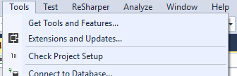
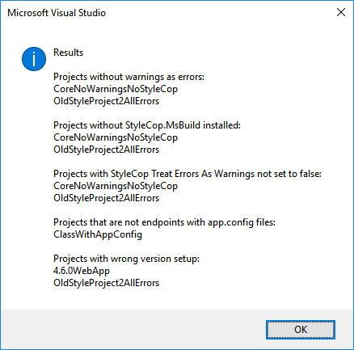

# VsProjectSetupPlugin

This plugin is intended to help ensure that Visual Studio projects follow some standards.

All projects should:

* Have "Warnings as Errors" enabled
* Have the StyleCop.MsBuild nuget installed
* Have the StyleCop warnings as errors setting enabled
  * E.g. have `<StyleCopTreatErrorsAsWarnings>false</StyleCopTreatErrorsAsWarnings>` in the csproj file
* Not have app.config files in non-endpoint projects
* Be .Net 4.6.2 or Core 2.0 for Endpoint projects or .Net 4.6.2 or Standard 2.0 for non-endpoint projects

An End-point project could be:

* Xunit Project
* MVC site
* Webforms site
* NSB host
* .exe project

This plugin is intended to work with:

* Visual Studio 2017
* Old style .vsproj files
* New style .vsproj files

Screenshots:

